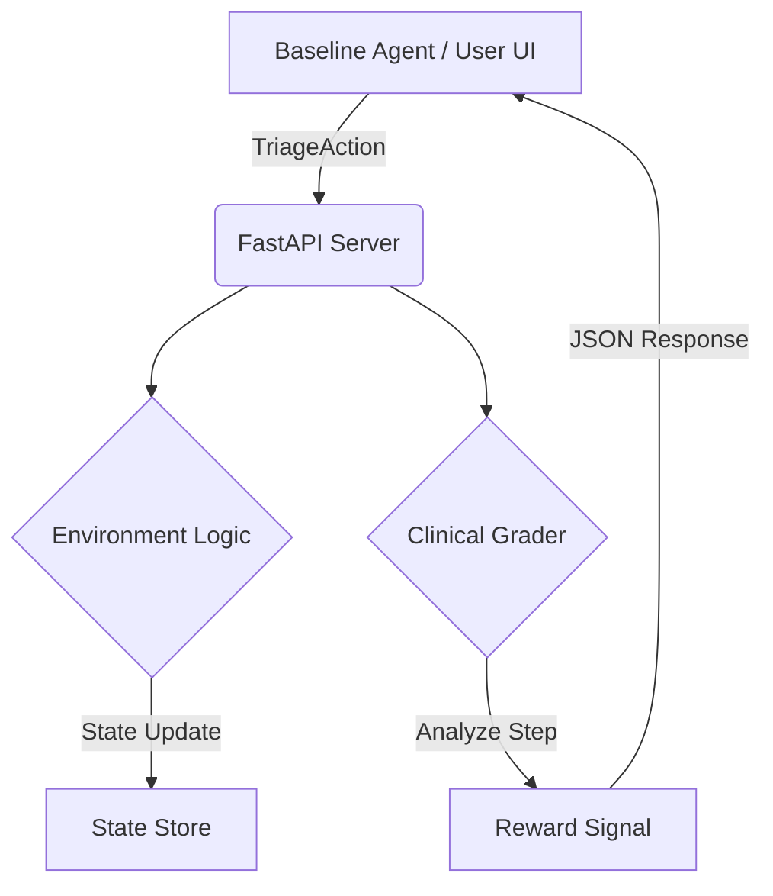

# 🩺 Technical Deep-Dive: ClinicalTriageEnv-v0
**System Architecture & Clinical Logic Specification**

## 1. System Overview
**ClinicalTriageEnv-v0** is a discrete-time, partially observable Markov Decision Process (POMDP) environment. It is designed to evaluate both the **diagnostic accuracy** and the **operational efficiency** of AI agents in a simulated Emergency Department (ED).

### 1.1 Core Architecture
The system follows a decoupled architecture to ensure that environment logic remains "pure" while allowing for complex, multi-objective grading.

---

## 2. Clinical Data Modeling
The environment uses a synthetic data engine calibrated against real-world Emergency Severity Index (ESI) trends.

### 2.1 ESI Vital Sign Mapping
Every patient is generated with a "True ESI" which strictly controls the ranges of their hidden vitals. This ensures that a "Correct" agent must look for specific physiological triggers.

| ESI Level | HR (BPM) | SBP (mmHg) | SpO2 (%) | RR (breaths/min) | Clinical Interpretation |
|:---|:---|:---|:---|:---|:---|
| **1** | 110–160 | 60–89 | 80–89 | 25–35 | **Life-Threatening** |
| **2** | 100–130 | 85–100 | 88–93 | 20–28 | **Emergent** |
| **3** | 88–110 | 100–125 | 93–97 | 16–22 | **Urgent** |
| **4** | 70–95 | 115–135 | 96–99 | 14–18 | **Non-Urgent** |
| **5** | 60–85 | 115–130 | 97–100 | 12–16 | **Stable** |

---

## 3. The Token Economy & Resource Management
To simulate the pressure of a real ED, the agent is constrained by a "Token Economy."

### 3.1 Action Costs
Actions are not free. Agents must manage a budget of **10 Action Tokens** which refresh as patients are dispositioned.

- **Observe Vitals:** 1 Token (Low Cost)
- **Order Labs:** 2 Tokens + 1 Lab Slot
- **Order Imaging:** 3 Tokens + 1 Imaging Slot
- **Assign Triage:** 0 Tokens (Decision)
- **Admit/Discharge:** 0 Tokens (Ends interaction)

### 3.2 Physical Constraints
- **Beds:** 12 available (Increases wait times if full).
- **Lab Slots:** 8 total per shift.
- **Imaging Slots:** 4 total per shift (Highly scarce).

---

## 4. Grading & Reward Function (Technical Breakdown)
The environment provides a scalar reward $R \in [0, 1]$ per step.

### 4.1 Triage Accuracy Formula
The base score $S_{base}$ is defined by the absolute difference between `assigned_esi` and `true_esi`:
- $\Delta = 0 \implies 1.0$
- $\Delta = 1 \implies 0.65$
- $\Delta = 2 \implies 0.35$

### 4.2 Information-Value Bonus/Penalty
If an agent triages a patient **without** observing vitals, they receive a **-0.10 penalty**. If they observe vitals first, they receive a **+0.10 bonus**.

### 4.3 Efficiency Guardrails
- **Redundant Check:** Observing vitals twice on the same patient yields a score of **0.15** (Wasted move).
- **Dangerous Discharge:** Discharging a patient with a true ESI of 1 or 2 yields a **0.05** (Critical Failure).

---

## 5. UI/UX Design: "Command Center"
The frontend is built as a **Headless Monitoring Dashboard**. 
- **Real-time Sparklines:** Visualize the variance in agent confidence across steps.
- **Acuity Indicators:** Pulsing animations for ESI-1 patients to create "Visual Urgency" for human-in-the-loop testing.
- **Diagnostics API:** A `/diagnostics` endpoint heartbeat ensures the LLM is reachable before the simulation begins.

## 6. Conclusion
**ClinicalTriageEnv-v0** provides the necessary complexity for modern RL research while maintaining a lightweight, Docker-ready footprint. It is ready for deployment as a baseline for medical decision-support systems.
